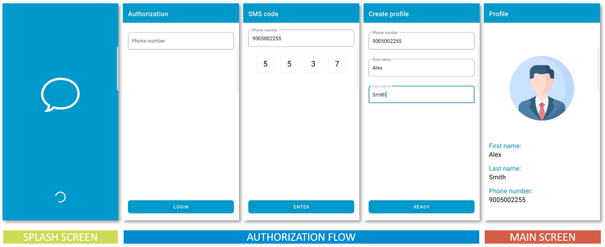

# Architecture-Components-Homework

## Часть 1: (на 4)
Аналогично перыдущему заданию, осуществить перевод приложения на архитектуру MVVM с использованием LiveData и ViewModel компонента. Убедиться, что Activity сохраняет своё состояние при перевороте экрана.

Работу следует выполнять в отдельном репозитории, ответвлённом от репозитория предыдущей домашней работы:

https://github.com/Epam-Android-Lab/Architecture/tree/master

## Часть 2: (на 5)
Реализовать навигацию приложения (с прокидыванием аргументов) на заготовленных фрагментах с помощью Navigation Component.
Код в репозитории не содержит изменений, который были добавлены на лекции - проделайте их заново, чтобы лучше усвоить фреймворк.

Работу следует выполнять в отдельном репозитории, ответвлённом от текущего репозитория:

https://github.com/Epam-Android-Lab/Architecture-Components-Homework
